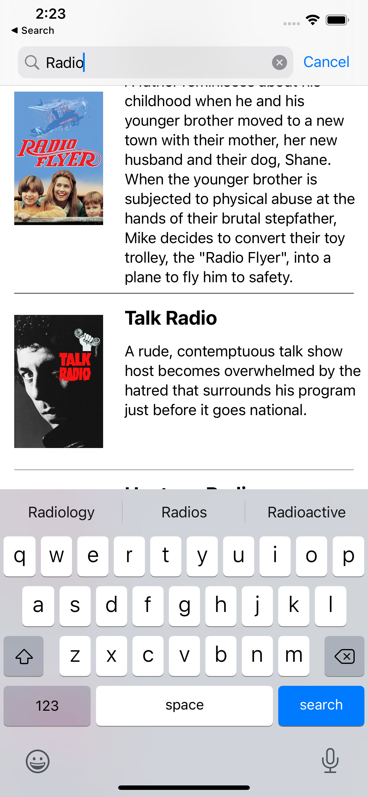

# Movie-List
A demo project for iOS using Swift UI.

## Topics

Swift, Swift UI, MVVM, Searchable, Text, JSONDecoder, API.

## Challenges

From [The Movie DB](https://api.themoviedb.org/3/search/movie?api_key=38e61227f85671163c275f9bd95a8803&query=marvel):
>1. Use the given URL to parse JSON data and show in the
application.
>2. Show poster image, title and overview from JSON.
>3. User can search query like Marvel, Harry Potter to see the desired movie list they want.
>4. Avoid using 3rd pary library.
>5. Maintain architectural pattern.
>
## Screenshots

